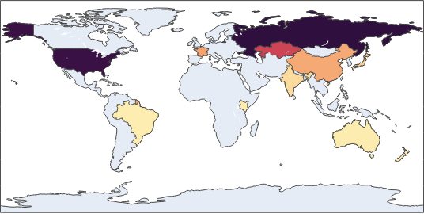
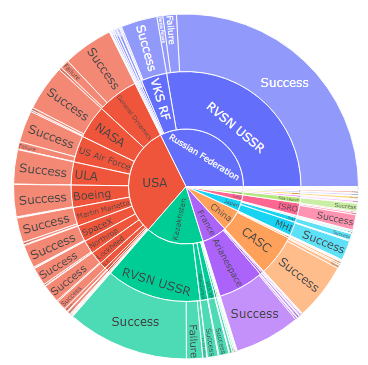

# Mateusz Halikowski

# [Project 4: Flights ETL Pipeline](https://github.com/halikowski/FlightsETL)
  An ETL pipeline project for flights data from Wrocław,Poland (WRO / EPWR) airport to many chosen European countries. Both departure airport and destination countries list are       fully customizable in config.py file. Final output is three data frames loaded as separate .csv files.
   
  Apache Airflow implementation is added, allowing for scheduling and automating this pipeline.
   
  Stack:
  <ul>
    <li>Pandas </li>
    <li>Requests </li>
    <li>BeautifulSoup </li>
    <li>Apache Airflow </li>
  </ul>

  

# [Project 3: US Fatal Shootings](https://nbviewer.org/github/halikowski/US_Shootings_Project/blob/main/US_Fatal_Shootings.ipynb)
  A data exploratory and analysis project focused on data set of fatal police shootings in US across the years 2015-2017. Not only this analyses the shooting victims' directly, but     also separate files representing aspects like poverty, schooling or race distribution. Analysis has been done using Python and it's packages.

  

  
  
  
  

# [Project 2: Space Mission Analysis](https://nbviewer.org/github/halikowski/Space-Missions-Project/blob/main/Space_Missions_Analysis.ipynb)
  Cleaning and analysis of a space missions dataset. This dataset contains space mission data for years 1957-2020, including the 'Cold War' between USA and USSR. It is my first         professional project, done solely by me, as a beiginning of Data Engineering and Data Science journey.
  
  
    
  
# [Project 1: Steam Scraper](https://github.com/halikowski/SteamScraper)
  A pretty simple Steam store website web scraper. It collects data from the Bestseller category and returns it in a .csv file. An example file of scraped data is attached. Scraped     data contains Game name, store release date and price - for almost 10k games listed. Created mainly with Python's Selenium package.
