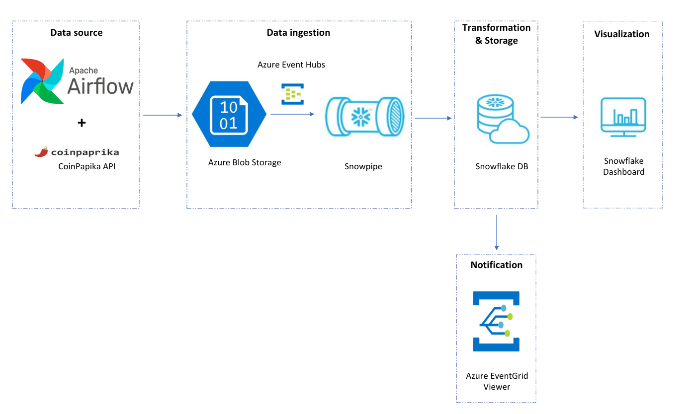

# Mateusz Halikowski
# [Project 8: Pollution in Poland - Snowflake ETL & Streamlit App](https://github.com/halikowski/PolishPollution)
  This project aims for creating a **Streamlit** app, preceded by utilizing **Snowflake** tools like **Dynamic Tables**, **Stored Procedures** and **SnowPipes**.
Project is focused on air pollution, weather conditions and population data for cities over 100k population in Poland.
It could obviously be used for larger list of locations and/or different population criteria - once higher API subscription is provided.

Tech stack:
- **Snowflake cloud**
- **AWS S3**
- **GitHub Actions**
- **Streamlit**

  
  

# [Project 7: Dynamic Azure Data Factory pipeline with CI/CD](https://github.com/halikowski/Azure-Rebrickable/blob/main/Azure_dynamic_pipeline_with_CICD.pdf)
  This project focuses on building a dynamic, scalable pipeline in Azure Data Factory together with the incorporation of **CI/CD in Azure DevOps**. Data used in this project comes from the [Rebrickable website](https://rebrickable.com/home/), which provides numerous files updated daily, ready for download, and also an API. Both names & number of files are customizable by JSON file in data lake. The same applies for the API files – for this purpose, 2 user accounts have been created to mimic a custom user-database, on base which we query data of user’s Lego sets, parts, etc.

Resources & features used in this project:
- **Azure Data Factory**
- **Azure Databricks**
- **Azure Logic Apps**
- **Azure DevOps**
- Other common resources like **Data Lake**

# [Project 6: Automated ETL + Visualization - Swiss Transport](https://github.com/halikowski/SwissTransport)
  This is a Data Engineering project containing both web automation processes and an ETL workflow. Also a few dashboards to top it out. As a person highly interested and connected with transport and travel, i started searching for this topic related project opportunities and found an interesting open data platform - Swiss Transport.  
  
  This project consists of fully automated ETL workflow with following stages:  
- Scheduled download and processing of total 12 data files with various formats (.csv, .xlsx, .json) - using **Selenium**
- File downloads are divided into 4 separate frequencies: daily, weekly, monthly, yearly - depending on data type and data source update frequency
- Automated file ingestion to **Snowflake** via **SnowSQL**, right after file is successfully processed
- Transformations & Final tables output using **Snowpark**
- All that scheduled in **Airflow** (5 different DAGs), running on a **Docker** container.
- Consumption-ready data is analyzed in **Qlik Sense** sheets (using Snowflake connection) - with 3 separate Dashboards as an output.

  [PDF Project Overview](https://github.com/halikowski/SwissTransport/blob/master/SWISS_TRANSPORT-Overview.pdf)

  
  
  

  
# [Project 5: Real-Time Cryptocurrency ETL Pipeline](https://github.com/halikowski/CryptoETL)
  This is a real-time cloud ETL project for cryptocurrency data using CoinPaprika API.

- What are the newest cryptocurrencies released?
- Which crytocurrencies seem to be bullish in the recent minutes or hours?
- Which of them are facing so called close-calls with ATHs(All Time High values) and which of them have just hit a new one recently?

These and many more questions could have been answered using this automated real-time ETL pipeline.
This project incorporates **Azure Blob Storage** as a direct ingestion place for response from API and **Snowflake SnowPipe** for ingestion into Snowflake cloud and further manipulations. **Azure Storage Queue & Event** hubs were used to set up the SnowPipe.

Additionally, **Azure Event Grid Viewer** is set for obtaining notifications regarding any warnings or errors during snowflake tasks processing.  
Finally, a basic data visualization dashboard is created in Snowflake, showing most important data by hand.  
The final, consumption-ready stage offers 3 tables - fact table FACT_COIN and 2 related dimension tables DIM_MARKET and DIM_COIN_DETAILS.  

  Stack: **Python / Apache Airflow / Azure Storage & Events / Snowflake** 

  

  
  
  

# [Project 4: Flights ETL Pipeline](https://github.com/halikowski/FlightsETL)
  An ETL pipeline project for flights data from Wrocław,Poland (WRO / EPWR) airport to many chosen European countries. Both departure airport and destination countries list are       fully customizable in config.py file. Final output is three data frames loaded as separate .csv files.
   
  Apache Airflow implementation is added, allowing for scheduling and automating this pipeline.
   
  Stack:
  <ul>
    <li>Pandas </li>
    <li>Requests </li>
    <li>BeautifulSoup </li>
    <li>Apache Airflow </li>
  </ul>

  

# [Project 3: US Fatal Shootings](https://nbviewer.org/github/halikowski/US_Shootings_Project/blob/main/US_Fatal_Shootings.ipynb)
  A data exploratory and analysis project focused on data set of fatal police shootings in US across the years 2015-2017. Not only this analyses the shooting victims' directly, but     also separate files representing aspects like poverty, schooling or race distribution. Analysis has been done using Python and it's packages.

  

  
  
  
  

# [Project 2: Space Mission Analysis](https://nbviewer.org/github/halikowski/Space-Missions-Project/blob/main/Space_Missions_Analysis.ipynb)
  Cleaning and analysis of a space missions dataset. This dataset contains space mission data for years 1957-2020, including the 'Cold War' between USA and USSR. It is my first         professional project, done solely by me, as a beiginning of Data Engineering and Data Science journey.
  
  
    
  
# [Project 1: Steam Scraper](https://github.com/halikowski/SteamScraper)
  A pretty simple Steam store website web scraper. It collects data from the Bestseller category and returns it in a .csv file. An example file of scraped data is attached. Scraped     data contains Game name, store release date and price - for almost 10k games listed. Created mainly with Python's Selenium package.
